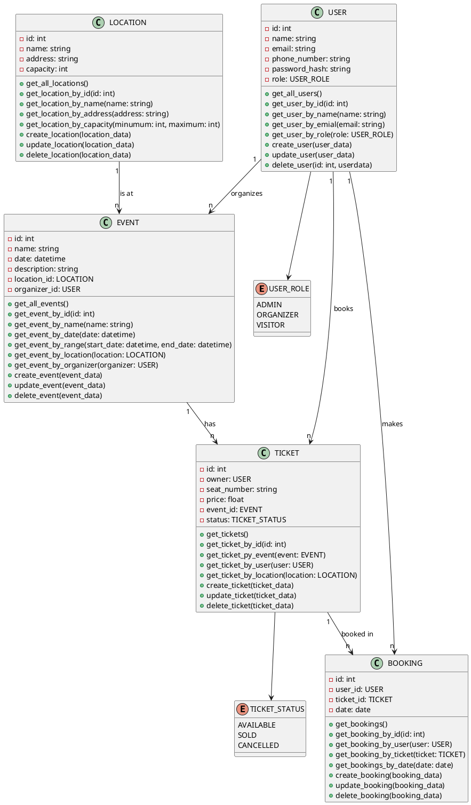

```plantuml
@startuml

enum USER_ROLE {
    ADMIN
    ORGANIZER
    VISITOR
}

enum TICKET_STATUS {
    AVAILABLE
    SOLD
    CANCELLED
}

class USER {
    - id: int
    - name: string
    - email: string
    - phone_number: string
    - password_hash: string
    - role: USER_ROLE

    + get_all_users()
    + get_user_by_id(id: int)
    + get_user_by_name(name: string)
    + get_user_by_emial(email: string)
    + get_user_by_role(role: USER_ROLE)
    + create_user(user_data)
    + update_user(user_data)
    + delete_user(id: int, userdata)
}

class LOCATION {
    - id: int
    - name: string
    - address: string
    - capacity: int

    + get_all_locations()
    + get_location_by_id(id: int)
    + get_location_by_name(name: string)
    + get_location_by_address(address: string)
    + get_location_by_capacity(minumum: int, maximum: int)
    + create_location(location_data)
    + update_location(location_data)
    + delete_location(location_data)
}

class EVENT {
    - id: int
    - name: string
    - date: datetime
    - description: string
    - location_id: LOCATION
    - organizer_id: USER

    + get_all_events()
    + get_event_by_id(id: int)
    + get_event_by_name(name: string)
    + get_event_by_date(date: datetime)
    + get_event_by_range(start_date: datetime, end_date: datetime)
    + get_event_by_location(location: LOCATION)
    + get_event_by_organizer(organizer: USER)
    + create_event(event_data)
    + update_event(event_data)
    + delete_event(event_data)
}

class TICKET {
    - id: int
    - owner: USER
    - seat_number: string
    - price: float
    - event_id: EVENT
    - status: TICKET_STATUS

    + get_tickets()
    + get_ticket_by_id(id: int)
    + get_ticket_py_event(event: EVENT)
    + get_ticket_by_user(user: USER)
    + get_ticket_by_location(location: LOCATION)
    + create_ticket(ticket_data)
    + update_ticket(ticket_data)
    + delete_ticket(ticket_data)
}

class BOOKING {
    - id: int
    - user_id: USER
    - ticket_id: TICKET
    - date: date

    + get_bookings()
    + get_booking_by_id(id: int)
    + get_booking_by_user(user: USER)
    + get_booking_by_ticket(ticket: TICKET)
    + get_bookings_by_date(date: date)
    + create_booking(booking_data)
    + update_booking(booking_data)
    + delete_booking(booking_data)
}

USER "1" --> "n" EVENT : organizes
USER "1" --> "n" BOOKING : makes
LOCATION "1" --> "n" EVENT : is at
EVENT "1" --> "n" TICKET : has
TICKET "1" --> "n" BOOKING : booked in
USER "1" --> "n" TICKET : books

USER --> USER_ROLE
TICKET --> TICKET_STATUS

@enduml
```